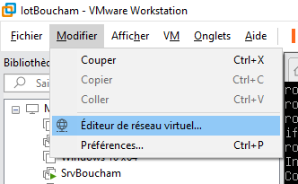
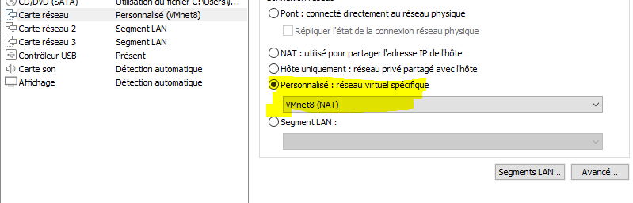

/# Administration Linux — Infrastructure Réseau & Hébergement Web
## Projet Agri-Tech : DNS + LAMP + FTP + Routage + NAT

> **ISGA Marrakech — Niveau 2CI-ISI** — Prof. Lahcen AITIBOUREK  
> Étudiant : Yassine Boucham  
> Date : 19/05/2026

---
## redémarrer la carte réseau ens33
Reseau virtue

Carte_reseau


- Méthode 1 : avec ip (simple)
```
sudo ip link set ens33 down
sudo ip link set ens33 up
```
- Méthode 2 : avec ifdown et ifup
```
sudo ifdown ens33
sudo ifup ens33
```
- Méthode 3 : redémarrer tout le service réseau
> Sur Debian classique :
```
sudo systemctl restart networking
```
> Si tu utilises systemd-networkd :
```
sudo systemctl restart systemd-networkd
```

## schéma de Projet
.svg)

## Table des matières

### 🔧 Partie 0 — Infrastructure Réseau (Pré-requis)
- [Architecture réseau cible](#architecture-réseau-cible)
- [Phase 1 — Identification des machines](#phase-1--identification-des-machines-hostnamectl)
- [Phase 2 — Configuration réseau systemd-networkd](#phase-2--configuration-réseau-systemd-networkd)
- [Phase 3 — Routage inter-VLAN et NAT nftables](#phase-3--routage-inter-vlan-et-nat-nftables)
- [Phase 4 — Validation et tests](#phase-4--validation-et-tests-finaux)

### 🌐 Partie 1 — Services Web (DNS + LAMP + FTP)
1. [Introduction](#introduction)
2. [Étape 1 — Préparation du serveur](#étape-1--préparation-du-serveur)
3. [Étape 2 — DNS avec BIND9](#étape-2--installation-et-configuration-dns-bind9)
4. [Étape 3 — Installation LAMP](#étape-3--installation-lamp)
5. [Étape 4 — Installation FTP (vsftpd)](#étape-4--installation-ftp-vsftpd)
6. [Étape 5 — Déploiement WordPress (nom.blog)](#étape-5--déploiement-wordpress-nomblog)
7. [Étape 6 — Déploiement Drupal (prenom.site)](#étape-6--déploiement-drupal-prenomsite)
8. [Vérification finale](#vérification-finale)
9. [Conclusion](#conclusion)

---


# 🔧 Partie 0 — Infrastructure Réseau

> ⚠️ **Cette partie doit être réalisée AVANT l'installation des services.**  
> Elle configure le réseau de base (routage, NAT) sur lequel tout le reste repose.

## Architecture réseau cible

```
                        INTERNET (WAN)
                             │
                    ┌────────▼────────┐
                    │   srv-linux     │
                    │  ens33: DHCP    │  ← NAT / Masquerade
                    │  ens34: 10.10.10.254
                    │  ens35: 20.20.20.254
                    └──────┬──────┬───┘
                           │      │
               ┌───────────▼┐    ┌▼────────────┐
               │  LAN Admin │    │   LAN IoT   │
               │10.10.10.11 │    │ 20.20.20.22 │
               │client-admin│    │ client-iot  │
               └────────────┘    └─────────────┘
```

| Machine       | Interface | Adresse IP       | Rôle              |
|---------------|-----------|------------------|-------------------|
| srv-linux     | ens33     | DHCP (NAT WAN)   | Routeur / Serveur |
| srv-linux     | ens34     | 10.10.10.254/24  | Gateway LAN Admin |
| srv-linux     | ens35     | 20.20.20.254/24  | Gateway LAN IoT   |
| client-admin  | ens33     | 10.10.10.11/24   | Client Admin      |
| client-iot    | ens33     | 20.20.20.22/24   | Client IoT        |

---

## Phase 1 — Identification des machines (hostnamectl)

> 💡 **Pourquoi hostnamectl ?** Contrairement à modifier `/etc/hostname` manuellement, `hostnamectl` applique le changement immédiatement sans redémarrage, met à jour le nom dans systemd, et garantit la cohérence de tout l'environnement système.

### Sur srv-linux (routeur)

```bash
hostnamectl set-hostname srv-linux
sudo nano /etc/hosts
```

Dans `/etc/hosts`, modifier la ligne `127.0.1.1` :

```
127.0.1.1   srv-linux
```

### Sur client-admin

```bash
hostnamectl set-hostname client-admin
sudo nano /etc/hosts
# Modifier : 127.0.1.1   client-admin
```

### Sur client-iot

```bash
hostnamectl set-hostname client-iot
sudo nano /etc/hosts
# Modifier : 127.0.1.1   client-iot
```

Vérifier sur chaque machine :

```bash
hostnamectl status
```

> 📸 **Preuve N°1** — Sur `client-iot`, résultat de `hostnamectl status`  
> `[ Insérez votre capture d'écran ici ]`

---

## Phase 2 — Configuration réseau (systemd-networkd)

> 💡 **ifupdown vs systemd-networkd** : `ifupdown` est l'ancien système de configuration réseau Debian, basé sur des scripts shell et le fichier `/etc/network/interfaces`. Il est statique et nécessite des redémarrages. `systemd-networkd` est le système moderne intégré à systemd : il gère la configuration de façon déclarative (fichiers `.network`), réagit dynamiquement aux changements matériels, et s'intègre nativement avec `resolved` pour le DNS. C'est le standard Debian 13.

### Nettoyage préalable (sur les 3 machines)

```bash
systemctl stop networking
systemctl disable networking
mv /etc/network/interfaces /etc/network/interfaces.backup
systemctl enable systemd-networkd
systemctl start systemd-networkd
```
-> You can check if systemd-networkd is being used with these commands:
```
    systemctl status systemd-networkd
```
- If it is active, you will see something like:
* Active: active (running)

-> You can also verify which service manages your interfaces:
```
    networkctl
```
- If systemd-networkd is managing the network, it will list your interfaces with states like:
* IDX LINK  TYPE     OPERATIONAL    SETUP
  2 ens33   ether    routable       configured

-> Another useful check:
```
    systemctl is-enabled systemd-networkd
```
- Results:
* enabled → starts automatically at boot
* disabled → not enabled
* masked → blocked from starting

### Configuration du routeur srv-linux

Créer les 3 fichiers dans `/etc/systemd/network/` :

**Fichier `10-wan.network`** (Interface WAN vers Internet) :

```ini
[Match]
Name=ens33

[Network]
DHCP=ipv4
```

**Fichier `20-lan-admin.network`** (LAN Admin) :

```ini
[Match]
Name=ens34

[Network]
Address=10.10.10.254/24
IPForward=ipv4
```

**Fichier `30-lan-iot.network`** (LAN IoT) :

```ini
[Match]
Name=ens35

[Network]
Address=20.20.20.254/24
IPForward=ipv4
```

> 💡 **IPForward=ipv4** remplace la commande `sysctl -w net.ipv4.ip_forward=1`. Le forwarding est activé directement dans la configuration systemd-networkd, de façon persistante et sans modifier `/etc/sysctl.conf`.

```bash
systemctl restart systemd-networkd
networkctl status
```

> 📸 **Preuve N°2** — `networkctl status` sur srv-linux montrant les 3 interfaces "configured"  
> `[ Insérez votre capture d'écran ici ]`

### Configuration de client-admin

Créer `/etc/systemd/network/10-lan.network` :

```ini
[Match]
Name=ens33

[Network]
Address=10.10.10.11/24
Gateway=10.10.10.254
DNS=8.8.8.8
```

```bash
systemctl restart systemd-networkd
```

### Configuration de client-iot

Créer `/etc/systemd/network/10-lan.network` :

```ini
[Match]
Name=ens33

[Network]
Address=20.20.20.22/24
Gateway=20.20.20.254
DNS=8.8.8.8
```

```bash
systemctl restart systemd-networkd
```

> 📸 **Preuve N°3** — Sur `client-admin`, résultat de `networkctl status ens33` (IP + Gateway visibles)  
> `[ Insérez votre capture d'écran ici ]`

---

## Phase 3 — Routage inter-VLAN et NAT (nftables)

> 💡 `nftables` est le successeur de `iptables` sur Debian 13. Il unifie la gestion des règles IPv4/IPv6 dans un seul framework plus lisible et plus performant.

Sur **srv-linux** :

```bash
# 1. Créer la table NAT pour IPv4
nft add table ip nat

# 2. Créer la chaîne postrouting
nft add chain ip nat postrouting \{ type nat hook postrouting priority 100 \; \}

# 3. Ajouter la règle Masquerade sur l'interface WAN
nft add rule ip nat postrouting oifname "ens33" masquerade

# 4. Vérifier la configuration
nft list table ip nat
```

Résultat attendu :

```
table ip nat {
    chain postrouting {
        type nat hook postrouting priority srcnat; policy accept;
        oifname "ens33" masquerade
    }
}
```

> 📸 **Preuve N°4** — Résultat de `nft list table ip nat` avec la règle masquerade  
> `[ Insérez votre capture d'écran ici ]`

---

## Phase 4 — Validation et tests finaux

Depuis **client-admin**, tester l'architecture complète :

```bash
# Test 1 : Routage inter-VLAN (client-admin → client-iot)
ping -c 2 20.20.20.22

# Test 2 : NAT et résolution DNS (accès Internet)
ping -c 2 google.com
```

> 📸 **Preuve N°5** — Les 2 pings réussis depuis `client-admin` (inter-VLAN + Internet)  
> `[ Insérez votre capture d'écran ici ]`

---

---

# 🌐 Partie 1 — Services Web (DNS + LAMP + FTP)

## Introduction

Une fois l'infrastructure réseau de la Partie 0 opérationnelle, cette partie installe et configure les services web sur **srv-linux** :

- **DNS (BIND9)** — résolution de noms pour 2 domaines
- **LAMP** — serveur web Apache + MySQL + PHP
- **FTP (vsftpd)** — transfert de fichiers depuis Windows
- **WordPress** sur `nom.blog`
- **Drupal** sur `prenom.site`

> 💡 Environnement : Debian 13 / Ubuntu Server — VMware — Prof. Lahcen AITIBOUREK  
> 🔗 Toutes les commandes sont exécutées sur **srv-linux** (10.10.10.254 / 20.20.20.254)

---

## Étape 1 — Préparation du serveur

### 1.1 Mise à jour du système

Avant toute installation, mettre à jour les paquets :

```bash
sudo apt update
sudo apt upgrade -y
```

> 📸 **Capture 1** — Résultat de `apt update` / `apt upgrade`  
> `[ Insérez votre capture d'écran ici ]`

---

### 1.2 Configuration du nom d'hôte

Définir le nom du serveur avec `hostnamectl` :

```bash
sudo hostnamectl set-hostname srv-linux
hostnamectl
```

> 📸 **Capture 2** — Résultat de la commande `hostnamectl`  
> `[ Insérez votre capture d'écran ici ]`

---

### 1.3 Configuration réseau (systemd-networkd)

Configurer les interfaces réseau dans `/etc/netplan/` ou via `systemd-networkd` selon votre environnement. Vérifier l'adresse IP :

```bash
ip addr show
```

> 📸 **Capture 3** — Résultat de `ip addr show` (interfaces et adresses IP)  
> `[ Insérez votre capture d'écran ici ]`

---

## Étape 2 — Installation et configuration DNS (BIND9)

### 2.1 Installation de BIND9

```bash
sudo apt install bind9 bind9utils bind9-doc -y
sudo systemctl status bind9
```

> 📸 **Capture 4** — BIND9 installé et service actif (status vert)  
> `[ Insérez votre capture d'écran ici ]`

---

### 2.2 Zone directe — nom.blog

Déclarer la zone dans `/etc/bind/named.conf.local` :

```
zone "nom.blog" {
    type master;
    file "/etc/bind/db.nom.blog";
};
```

Créer le fichier de zone `/etc/bind/db.nom.blog` :

```
$TTL 604800
@   IN  SOA  srv-linux.nom.blog. admin.nom.blog. (
              2024010101 604800 86400 2419200 604800 )
@       IN  NS   srv-linux.nom.blog.
srv-linux IN A   192.168.1.10
@       IN  A    192.168.1.10
www     IN  CNAME @
ftp     IN  CNAME @
mail    IN  CNAME @
```

> 📸 **Capture 5** — Contenu du fichier `db.nom.blog`  
> `[ Insérez votre capture d'écran ici ]`

---

### 2.3 Zone directe — prenom.site

Répéter la même opération pour `prenom.site` (Drupal) dans `named.conf.local` et créer `db.prenom.site` avec la même structure.

> 📸 **Capture 6** — Contenu du fichier `db.prenom.site`  
> `[ Insérez votre capture d'écran ici ]`

---

### 2.4 Zone inverse (PTR)

Déclarer la zone inverse dans `named.conf.local` :

```
zone "1.168.192.in-addr.arpa" {
    type master;
    file "/etc/bind/db.192";
};
```

Fichier `/etc/bind/db.192` :

```
$TTL 604800
@   IN  SOA  srv-linux.nom.blog. admin.nom.blog. (
              2024010101 604800 86400 2419200 604800 )
@   IN  NS   srv-linux.nom.blog.
10  IN  PTR  srv-linux.nom.blog.
```

> 📸 **Capture 7** — Contenu du fichier `db.192` (zone inverse)  
> `[ Insérez votre capture d'écran ici ]`

---

### 2.5 Vérification et redémarrage BIND9

```bash
sudo named-checkconf
sudo named-checkzone nom.blog /etc/bind/db.nom.blog
sudo named-checkzone prenom.site /etc/bind/db.prenom.site
sudo systemctl restart bind9
```

> 📸 **Capture 8** — `named-checkconf` et `named-checkzone` sans erreur  
> `[ Insérez votre capture d'écran ici ]`

---

### 2.6 Test de résolution DNS

```bash
nslookup nom.blog 127.0.0.1
nslookup www.nom.blog 127.0.0.1
nslookup ftp.nom.blog 127.0.0.1
```

> 📸 **Capture 9** — Résultats `nslookup` pour `nom.blog` et `prenom.site`  
> `[ Insérez votre capture d'écran ici ]`

---

## Étape 3 — Installation LAMP

### 3.1 Apache2

```bash
sudo apt install apache2 -y
sudo systemctl enable apache2
sudo systemctl status apache2
```

> 📸 **Capture 10** — Apache2 actif (status vert)  
> `[ Insérez votre capture d'écran ici ]`

---

### 3.2 MySQL / MariaDB

```bash
sudo apt install mysql-server -y
sudo mysql_secure_installation
```

> 📸 **Capture 11** — `mysql_secure_installation` terminé  
> `[ Insérez votre capture d'écran ici ]`

Créer les bases de données pour WordPress et Drupal :

```sql
sudo mysql -u root -p

CREATE DATABASE wordpress_db;
CREATE USER 'wp_user'@'localhost' IDENTIFIED BY 'motdepasse';
GRANT ALL PRIVILEGES ON wordpress_db.* TO 'wp_user'@'localhost';

CREATE DATABASE drupal_db;
CREATE USER 'drupal_user'@'localhost' IDENTIFIED BY 'motdepasse2';
GRANT ALL PRIVILEGES ON drupal_db.* TO 'drupal_user'@'localhost';

FLUSH PRIVILEGES;
EXIT;
```

> 📸 **Capture 12** — Création des bases de données WordPress et Drupal  
> `[ Insérez votre capture d'écran ici ]`

---

### 3.3 PHP

```bash
sudo apt install php php-mysql libapache2-mod-php -y
sudo apt install php-curl php-gd php-mbstring php-xml php-zip php-intl -y
php -v
```

> 📸 **Capture 13** — Version PHP affichée (`php -v`)  
> `[ Insérez votre capture d'écran ici ]`

---

### 3.4 Test PHP

```bash
echo "<?php phpinfo(); ?>" | sudo tee /var/www/html/info.php
# Ouvrir http://192.168.1.10/info.php dans le navigateur
sudo rm /var/www/html/info.php
```

> 📸 **Capture 14** — Page `phpinfo()` visible dans le navigateur  
> `[ Insérez votre capture d'écran ici ]`

---

## Étape 4 — Installation FTP (vsftpd)

### 4.1 Installation

```bash
sudo apt install vsftpd -y
sudo systemctl status vsftpd
```

> 📸 **Capture 15** — vsftpd installé et actif  
> `[ Insérez votre capture d'écran ici ]`

---

### 4.2 Configuration /etc/vsftpd.conf

Modifier le fichier de configuration pour activer l'écriture :

```bash
sudo nano /etc/vsftpd.conf
```

Lignes à modifier :

```
write_enable=YES
local_enable=YES
chroot_local_user=YES
allow_writeable_chroot=YES
```

```bash
sudo systemctl restart vsftpd
```

> 📸 **Capture 16** — Fichier `vsftpd.conf` avec les options modifiées  
> `[ Insérez votre capture d'écran ici ]`

---

### 4.3 Connexion depuis Windows avec FileZilla

| Paramètre  | Valeur              |
|------------|---------------------|
| Hôte       | `192.168.1.10`      |
| Port       | `21`                |
| Protocole  | FTP                 |
| Utilisateur| votre_user_linux    |

Transférer le fichier `wordpress.zip` vers `/var/www/html/` sur le serveur.

> 📸 **Capture 17** — FileZilla connecté, transfert de `wordpress.zip` en cours  
> `[ Insérez votre capture d'écran ici ]`

---

## Étape 5 — Déploiement WordPress (nom.blog)

### 5.1 Décompresser WordPress

```bash
cd /var/www/html
sudo unzip wordpress.zip -d wordpress
sudo chown -R www-data:www-data wordpress/
sudo chmod -R 755 wordpress/
```

> 📸 **Capture 18** — Décompression de `wordpress.zip` réussie  
> `[ Insérez votre capture d'écran ici ]`

---

### 5.2 Virtual Host Apache pour nom.blog

Créer `/etc/apache2/sites-available/nom.blog.conf` :

```apache
<VirtualHost *:80>
    ServerName nom.blog
    ServerAlias www.nom.blog
    DocumentRoot /var/www/html/wordpress
    <Directory /var/www/html/wordpress>
        AllowOverride All
        Require all granted
    </Directory>
</VirtualHost>
```

```bash
sudo a2ensite nom.blog.conf
sudo a2enmod rewrite
sudo systemctl reload apache2
```

> 📸 **Capture 19** — Site `nom.blog` activé, Apache rechargé  
> `[ Insérez votre capture d'écran ici ]`

---

### 5.3 Configuration WordPress

Ouvrir `http://nom.blog` dans le navigateur et suivre l'assistant d'installation WordPress (nom de la base, utilisateur, mot de passe).

> 📸 **Capture 20** — Page d'installation WordPress dans le navigateur  
> `[ Insérez votre capture d'écran ici ]`

> 📸 **Capture 21** — WordPress installé, dashboard accessible  
> `[ Insérez votre capture d'écran ici ]`

---

## Étape 6 — Déploiement Drupal (prenom.site)

### 6.1 Téléchargement et extraction

```bash
cd /var/www/html
sudo wget https://www.drupal.org/download-latest/zip -O drupal.zip
sudo unzip drupal.zip -d drupal
sudo chown -R www-data:www-data drupal/
sudo chmod -R 755 drupal/
```

> 📸 **Capture 22** — Drupal extrait dans `/var/www/html/drupal`  
> `[ Insérez votre capture d'écran ici ]`

---

### 6.2 Virtual Host Apache pour prenom.site

Créer `/etc/apache2/sites-available/prenom.site.conf` :

```apache
<VirtualHost *:80>
    ServerName prenom.site
    ServerAlias www.prenom.site
    DocumentRoot /var/www/html/drupal
    <Directory /var/www/html/drupal>
        AllowOverride All
        Require all granted
    </Directory>
</VirtualHost>
```

```bash
sudo a2ensite prenom.site.conf
sudo systemctl reload apache2
```

> 📸 **Capture 23** — Site `prenom.site` activé, Apache rechargé  
> `[ Insérez votre capture d'écran ici ]`

---

### 6.3 Installation de Drupal

Ouvrir `http://prenom.site` dans le navigateur et suivre l'assistant d'installation Drupal.

> 📸 **Capture 24** — Page d'installation Drupal dans le navigateur  
> `[ Insérez votre capture d'écran ici ]`

> 📸 **Capture 25** — Drupal installé, accueil du site accessible  
> `[ Insérez votre capture d'écran ici ]`

---

## Vérification finale

### Récapitulatif des services

| Service | Paquet        | Port | Rôle                            |
|---------|---------------|------|---------------------------------|
| DNS     | bind9         | 53   | Résolution noms de domaine      |
| Web     | apache2       | 80   | Hébergement WordPress / Drupal  |
| DB      | mysql-server  | 3306 | Base de données                 |
| PHP     | php           | —    | Traitement côté serveur         |
| FTP     | vsftpd        | 21   | Transfert de fichiers           |

### Test final de tous les services

```bash
sudo systemctl status bind9 apache2 mysql vsftpd
curl http://nom.blog
curl http://prenom.site
```

> 📸 **Capture 26** — Tous les services actifs (bind9, apache2, mysql, vsftpd)  
> `[ Insérez votre capture d'écran ici ]`

> 📸 **Capture 27** — `nom.blog` accessible dans le navigateur (WordPress)  
> `[ Insérez votre capture d'écran ici ]`

> 📸 **Capture 28** — `prenom.site` accessible dans le navigateur (Drupal)  
> `[ Insérez votre capture d'écran ici ]`

---

## Conclusion

Ce projet a permis de mettre en place une infrastructure complète réseau et hébergement web sur Linux. Les compétences acquises comprennent :

**Infrastructure réseau (Partie 0) :**
- Identification des machines avec `hostnamectl`
- Configuration réseau moderne avec `systemd-networkd`
- Routage inter-VLAN et NAT avec `nftables`

**Services web (Partie 1) :**
- Configuration d'un serveur DNS avec BIND9 (zones directe et inverse)
- Installation et configuration de la pile LAMP (Apache, MySQL, PHP)
- Déploiement de sites WordPress et Drupal avec Virtual Hosts Apache
- Configuration du service FTP avec vsftpd pour le transfert de fichiers
- Utilisation de FileZilla depuis Windows pour interagir avec le serveur Linux

> ⚠️ Toutes les captures d'écran (Preuves N°1 à 5 + Captures 1 à 28) doivent être insérées aux emplacements prévus avant la remise du rapport.